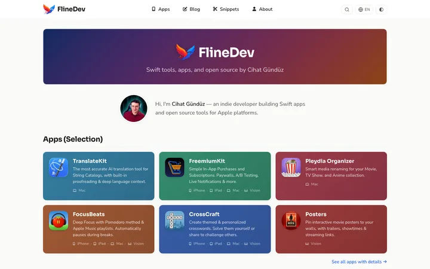
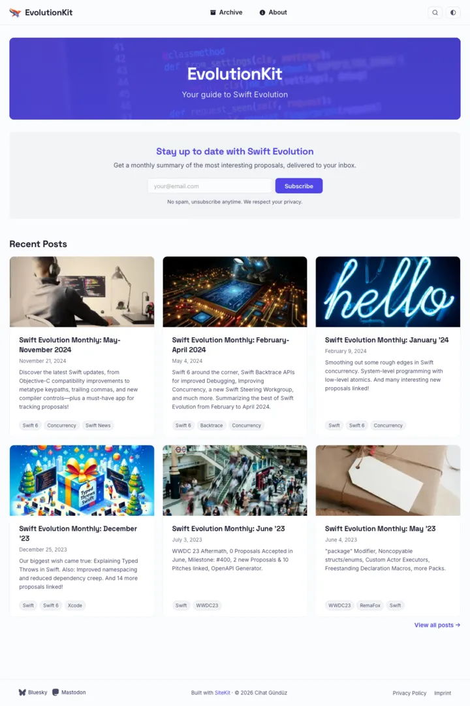
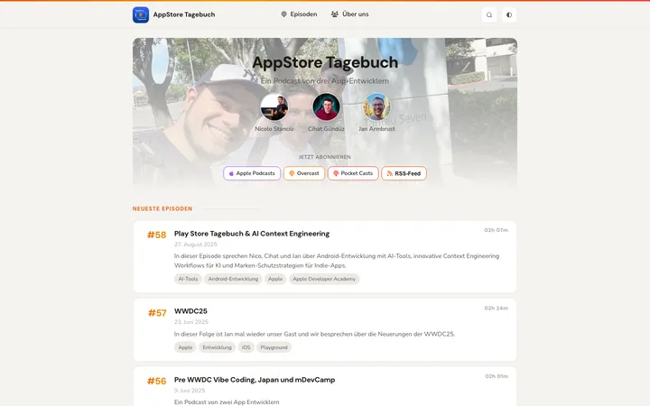
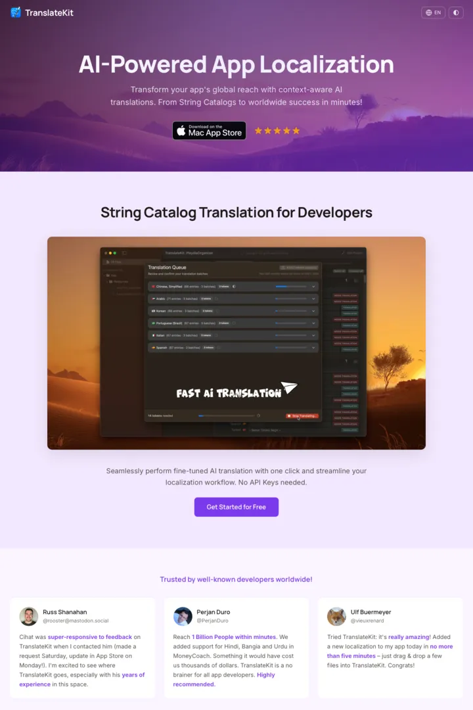
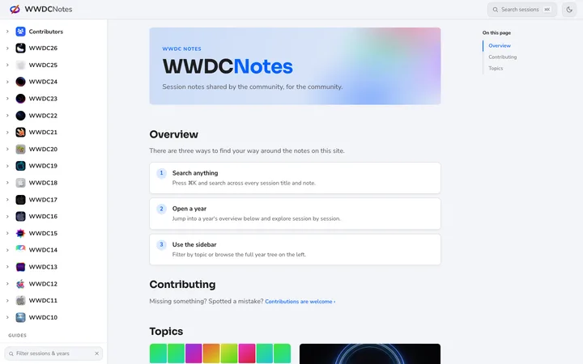

<p align="center">
  
  <br><br>
  <a href="#is-sitekit-for-you">Is it for you?</a> · <a href="#whats-built-in">Features</a> · <a href="#what-you-can-build">Blueprints</a> · <a href="#built-with-sitekit">Showcase</a> · <a href="#get-started">Get started</a> · <a href="#deploy">Deploy</a> · <a href="#contributing">Contributing</a>
  <br><br>
  
  
  
  
</p>

# SiteKit

**A static site generator written in Swift, designed to be driven by AI agents.**

SiteKit is a static site generator written in Swift, driven by AI agents through an installable skill (Claude Code, Codex, Cursor, Windsurf, Xcode 26, and more) – you hand the whole job to an AI that scaffolds, themes, writes, and deploys your site for you, or drive the `sitekit` CLI yourself. Either way the output is a fast, SEO-complete, accessible static site you host anywhere.

> _Built by an indie iOS developer for his own sites – every [demo](#built-with-sitekit) below is mine – and shared for anyone who'd rather ship with AI help than build from scratch. The guides are orientation to lean on, **not legal or professional advice**._

> **Looking for something specific?** The [use-case matrix](USE-CASES.md) maps every task – author, customize, deploy, extend – to the doc that answers it.

## 🤔 Is SiteKit for you?

**Yes, if you want to:**
- Ship a blog, podcast, newsletter, portfolio, or app-landing site as plain static files.
- Own your content as plain Markdown in a git repo – the site is a Swift package under the hood, but authoring needs no Swift code.
- Let an AI assistant do the heavy lifting (scaffolding, theming, content drafting, deployment).

**Probably not, if you need:**
- A server-rendered CMS with a database, user logins, or live dynamic pages.
- A no-code, point-and-click WYSIWYG editor.
- An environment without the Swift toolchain – building runs through `swift` (macOS or Linux), and authoring assumes you're comfortable editing text files.

## ✨ What's built in

You write Markdown; SiteKit handles the rest:

- 📝 **Plain Markdown authoring** – posts and pages in Markdown with YAML frontmatter, no Swift or HTML.
- 📱 **Responsive design** – layouts adapt to desktop, tablet, and phone out of the box.
- 🌗 **Dark & light mode** – follows the visitor's system preference, with a manual toggle.
- 🔍 **Built-in search** – a client-side index on a static site, full-text for docs.
- 🧭 **SEO complete** – canonical URLs, Open Graph, JSON-LD, hreflang, sitemap, robots, and `llms.txt`.
- ♿ **Accessibility-minded** – semantic HTML, keyboard navigation, WCAG-AA-tuned colour schemes.
- ⚡ **Fast by default** – critical-CSS ordering, responsive images, inlined icons, minification.
- 🌍 **AI-assisted localization** – multilingual with hreflang, fallback, and UI chrome in 36 locales.
- 👀 **Shareable draft previews** – unlisted URLs to share for feedback before publishing.
- ✍️ **Guided content writing** – built-in writing guides keep drafts on-brand.
- 🆓 **Free hosting** – deploy to Cloudflare Pages; you pay only for your domain.

## 🧩 What you can build

SiteKit ships **9 blueprints** – starter sites you scaffold and customise. Each has a short guide and a live demo:

| Blueprint | For | Guide | Live demo |
|---|---|---|---|
| **Blog** | Articles with categories, tags, RSS | [Blog.md](Plugin/blueprints/Blog.md) | [fline.dev/blog](https://fline.dev/blog) |
| **Snippets** | Short-form tips, TILs, cheat sheets | [Snippets.md](Plugin/blueprints/Snippets.md) | [fline.dev/snippets](https://fline.dev/snippets) |
| **Portfolio** | App / project showcase | [Portfolio.md](Plugin/blueprints/Portfolio.md) | [fline.dev/apps](https://fline.dev/apps) |
| **IndieDev** | Blog + snippets + portfolio combined | [IndieDev.md](Plugin/blueprints/IndieDev.md) | [fline.dev](https://fline.dev) |
| **Podcast** | Episode pages, audio player, iTunes RSS | [Podcast.md](Plugin/blueprints/Podcast.md) | [appstore-tagebuch.de](https://appstore-tagebuch.de) |
| **Newsletter** | Issue archive, signup forms, email rendering | [Newsletter.md](Plugin/blueprints/Newsletter.md) | [evolutionkit.dev](https://evolutionkit.dev) |
| **AppLanding** | Single product landing page (hero, features, pricing) | [AppLanding.md](Plugin/blueprints/AppLanding.md) | [translatekit.pages.dev](https://translatekit.pages.dev) |
| **DocC** | DocC catalog → docs site with sidebar + full-text search | [DocC.md](Plugin/blueprints/DocC.md) | [wwdcnotes.fline.dev](https://wwdcnotes.fline.dev) |
| **Plain** | Minimal, no opinions – a blank canvas | [Plain.md](Plugin/blueprints/Plain.md) | – |

Not sure which to pick? The [blueprint catalog](Plugin/blueprints/INDEX.md) has a decision tree and a feature comparison.

## 🖼️ Built with SiteKit

Real production sites, one per blueprint family. Screenshots follow your GitHub theme – dark or light.

<table>
  <tr>
    <td width="50%" valign="top">
      <a href="https://fline.dev">
        <picture>
          <source media="(prefers-color-scheme: dark)" srcset="Assets/Showcase/fline-dev-dark.webp">
          
        </picture>
      </a>
      <br><b><a href="https://fline.dev">fline.dev</a></b> – apps, blog, snippets &amp; portfolio <em>(IndieDev)</em>
    </td>
    <td width="50%" valign="top">
      <a href="https://evolutionkit.dev">
        <picture>
          <source media="(prefers-color-scheme: dark)" srcset="Assets/Showcase/evolutionkit-dev-dark.webp">
          
        </picture>
      </a>
      <br><b><a href="https://evolutionkit.dev">evolutionkit.dev</a></b> – Swift Evolution newsletter <em>(Newsletter)</em>
    </td>
  </tr>
  <tr>
    <td width="50%" valign="top">
      <a href="https://appstore-tagebuch.de">
        <picture>
          <source media="(prefers-color-scheme: dark)" srcset="Assets/Showcase/appstore-tagebuch-de-dark.webp">
          
        </picture>
      </a>
      <br><b><a href="https://appstore-tagebuch.de">appstore-tagebuch.de</a></b> – indie-dev podcast <em>(Podcast)</em>
    </td>
    <td width="50%" valign="top">
      <a href="https://translatekit.pages.dev">
        <picture>
          <source media="(prefers-color-scheme: dark)" srcset="Assets/Showcase/translatekit-dark.webp">
          
        </picture>
      </a>
      <br><b><a href="https://translatekit.pages.dev">TranslateKit</a></b> – app landing page <em>(AppLanding)</em>
    </td>
  </tr>
  <tr>
    <td width="50%" valign="top">
      <picture>
        <source media="(prefers-color-scheme: dark)" srcset="Assets/Showcase/wwdcnotes-dark.webp">
        
      </picture>
      <br><b>WWDCNotes</b> – community session notes across thousands of pages <em>(DocC, relaunch in progress)</em>
    </td>
    <td width="50%" valign="top"></td>
  </tr>
</table>

## 🚀 Get started

**The only hard requirement is the Swift 6.2 toolchain** (`swift --version`), on macOS or Linux – both run in CI. Everything else is optional and installed when it's actually needed: the AI assistant pulls in Git, the GitHub CLI (`gh`, only if you publish via GitHub), or ImageMagick (only if you want responsive image variants) on demand, and you pick where to host. SiteKit points you at the free, popular choices, but you can always swap in alternatives – the output is just static files.

### The AI-guided way (recommended)

SiteKit is built to be driven by an AI. Install its skill once and your assistant learns the whole workflow – scaffolding, theming, writing, and deployment.

**Any agent** (Claude Code, Codex, Cursor, Windsurf, Xcode 26, and [70+ more](https://skills.sh)) – install the [agent skill](https://agentskills.io):

```bash
npx skills add FlineDev/SiteKit
```

**Claude Code** – or install it as a plugin instead:

```
/plugin marketplace add FlineDev/SiteKit
/plugin install sitekit@sitekit
```

Either way, then just ask – *"build me a developer blog with SiteKit"* – and your assistant walks you through blueprint choice, theme, content, and deployment. Every site SiteKit scaffolds also gets an `AGENTS.md` so the assistant keeps the right guidance loaded as the site grows.

### The manual CLI way

Clone SiteKit and use the `sitekit` CLI directly:

```bash
git clone https://github.com/FlineDev/SiteKit.git
cd SiteKit
swift run sitekit doctor                          # check git + swift toolchain
swift run sitekit new MySite --blueprint Blog     # scaffold (defaults to Blog)
```

The clone is only needed for the scaffolder – your new site is standalone and pulls SiteKit as a regular Swift-package dependency, so you won't need the clone again until you scaffold the next site.

Then run your new site locally:

```bash
cd MySite
swift run Site serve                              # dev server on http://localhost:8080
```

`swift run Site build` produces the static output in `_Site/`; `swift run Site validate` checks for missing translations on multilingual sites.

## 📁 Your new site

| Path | What it holds |
|---|---|
| `Content/<section>/*.md` | Your posts, episodes, pages – Markdown with YAML frontmatter |
| `Theme/theme.yaml` | Color scheme, font pairing, layout template |
| `SiteConfig.yaml` | Site metadata: name, URL, author, navigation |
| `Content/Assets/` | Images and logo; pre-generated favicons go in `Content/Assets/Favicons/` |
| `_Site/` | Build output (gitignored) – what you deploy |

**Customise the look:** open `Theme/theme.yaml` and pick a **color scheme** (15 to choose from), a **font pairing** (6 options), and a **layout template** (Classic, Sidebar, Minimal). Override individual design tokens for full control.

Deeper references: [content writing](Plugin/skills/sitekit/references/content-writing.md) · [theming guide](Plugin/skills/sitekit/references/themes.md) · [SiteConfig reference](Plugin/skills/sitekit/references/siteconfig-reference.md).

## ☁️ Deploy

A build is just static files in `_Site/`, so **you can host it anywhere and switch hosts anytime** – the choice is yours.

SiteKit *recommends* **Cloudflare Pages** because it's free, fast, and documented end to end: [Cloudflare Pages walkthrough](Plugin/skills/sitekit/references/deployment/hosts/cloudflare-pages.md). Prefer something else? GitHub Pages, Netlify, Vercel, or your own server work the same way, and the assistant sets up whichever you pick. See [all deployment guides](Plugin/skills/sitekit/references/deployment/).

## 🛟 When something goes wrong

Build failing or output not what you expected? Start with the [troubleshooting guide](Plugin/skills/sitekit/references/troubleshooting.md) – it covers frontmatter errors, missing fields, and the most common build failures.

## 🔧 Extending with custom Swift

The blueprints cover the common cases. When you need something they don't ship – a custom page type, a new output file, a bespoke content transform – that's Swift territory. SiteKit's pipeline is a set of swappable plugins you conform to: see [AGENTS.md](AGENTS.md) for the architecture and the [custom-pages reference](Plugin/skills/sitekit/references/custom-pages.md) for a worked example.

## 🤝 Contributing

Issues and pull requests welcome. Start with [AGENTS.md](AGENTS.md) – the contributor reference for how SiteKit is built and how to extend it.

SiteKit is **v1.0**, the first public release. From here on, breaking changes always get a major version bump and documented migration steps in the [CHANGELOG](CHANGELOG.md).

**License:** [MIT](LICENSE).
